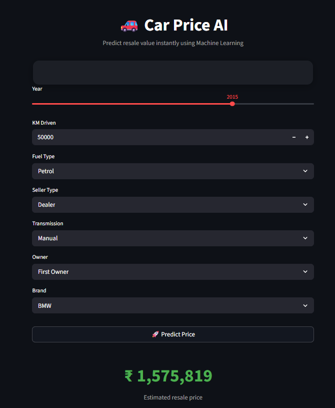

# 🚗 Car Price AI

Predict resale value instantly using Machine Learning.

---

## 📸 App Preview

<p align="center">
  
</p>

---

## 📊 Problem Statement

The goal of this project is to predict the selling price of used cars based on various features such as:
- Year of purchase
- Kilometers driven
- Fuel type
- Seller type
- Transmission
- Ownership history
- Brand

---

## 🛠️ Tech Stack

- Python
- Pandas, NumPy
- Scikit-learn
- XGBoost
- Streamlit

---

## ⚙️ Features

- Data cleaning and preprocessing
- Feature engineering (car age, brand extraction)
- Handling categorical data using encoding
- Model training using XGBoost Regressor and Random Forest Regressor
- Model evaluation using R² score
- Interactive Streamlit UI for real-time predictions

---

## 📈 Model Performance

- Achieved **R² Score ≈ 0.65**
- XGBoost performed better than baseline models
- Random Forest Regressor achieved **R² Score ≈ 0.63**

---

## 🧠 Key Learnings

- Feature engineering has a bigger impact than model complexity
- Proper handling of categorical data is crucial
- Importance of using pipelines for deployment
- Handling real-world issues like feature mismatch and version compatibility

---

## 🚀 How to Run the Project

### 1. Clone the repository

```bash
git clone https://github.com/your-username/car-price-ai.git
cd car-price-ai
